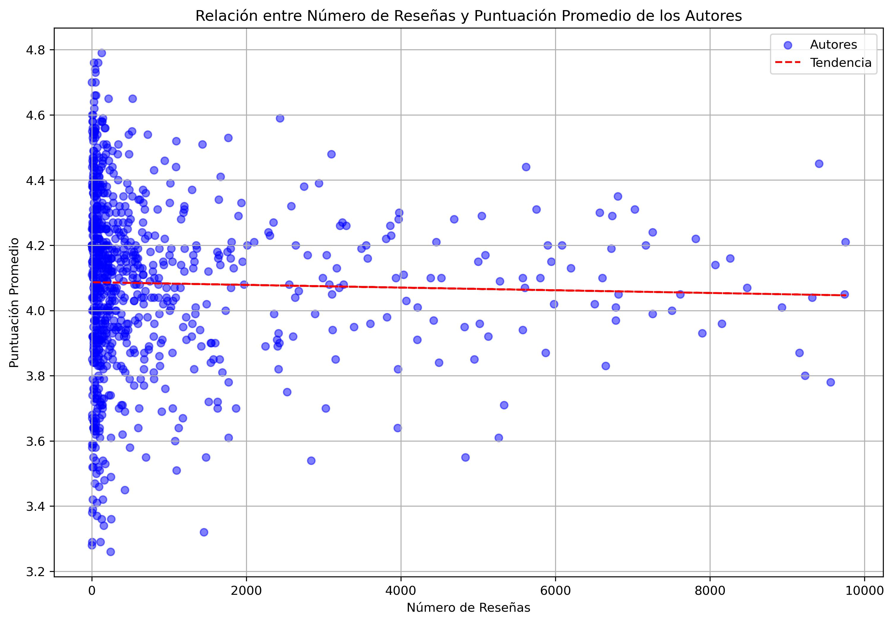
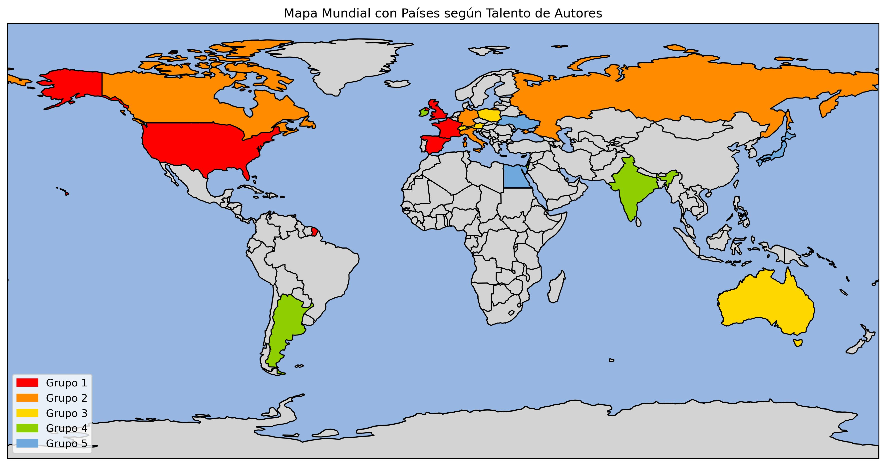
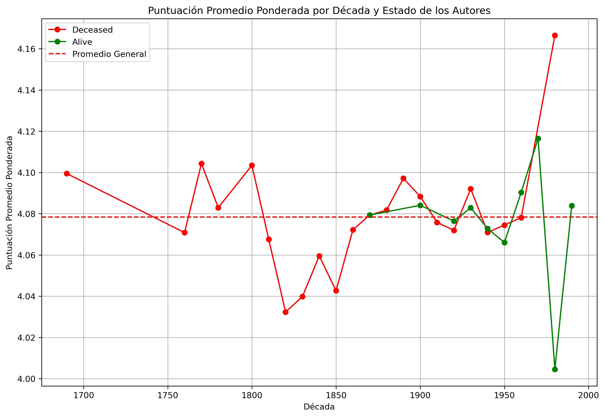
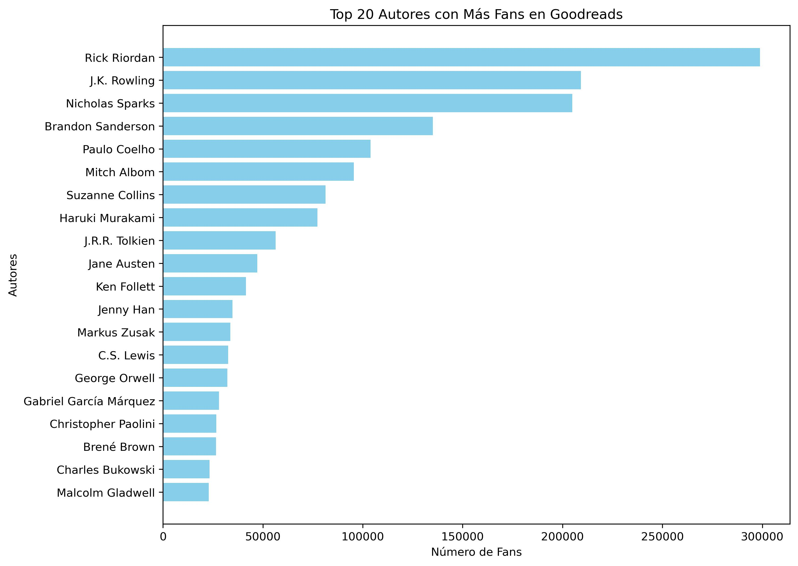
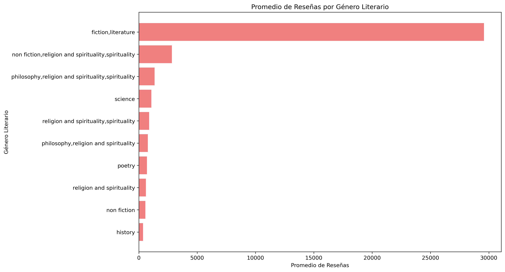

# Goodreads Data Insight

## Overview

This project analyzes the talent of authors on Goodreads using various metrics such as average rating, number of reviews, fan count, and more. The analysis is performed using SQL queries and visualized with Python libraries.

## Key Findings

1. **Relationship Between Number of Reviews and Average Rating**:
   - The scatterplot below shows the relationship between the number of reviews and the average rating of authors on Goodreads. Each point represents an author.

   

2. **Geographical Analysis**:
   - We examined the geographical distribution of successful authors. The map below highlights the countries with the most talented authors based on weighted ratings.

   

3. **Average Reviews by Decade**:
   - The line chart below shows the average number of reviews received by authors born in different decades.

   

4. **Top Authors by Number of Fans**:
   - The bar chart below displays the top 20 authors with the highest number of fans on Goodreads.

   

5. **Average Reviews by Genre**:
   - The bar chart below shows the average number of reviews for different literary genres.

   

## Requirements

```bash
pip3 install requests

```

## Database Structure Creation

In the terminal, run:

``` bash

# mysql -u root -p goodreads_insights < db/structure.sql # pidiendo pass

mysql goodreads_insights < db/structure.sql # sin pass de BBDD, usando un "my.cnf"

```

## Seeding tables

``` bash

python3 src/seeding.py
python3 src/seed_goodreads_authors.py
python3 src/merge_authors_books.py

```

## Backup/Restore

``` bash

mysqldump -u usuario -p --routines --triggers --events --databases nombre_base_de_datos > backup.sql

mysql -u usuario -p nombre_base_de_datos < backup.sql

```

## API

``` bash

python3 api/get_reviews_from_goodreads.py

```

## Sourcers

- Reviews + Books: <https://www.goodreads.com/review/import>
- Autores: <https://www.kaggle.com/datasets/choobani/goodread-authors>
